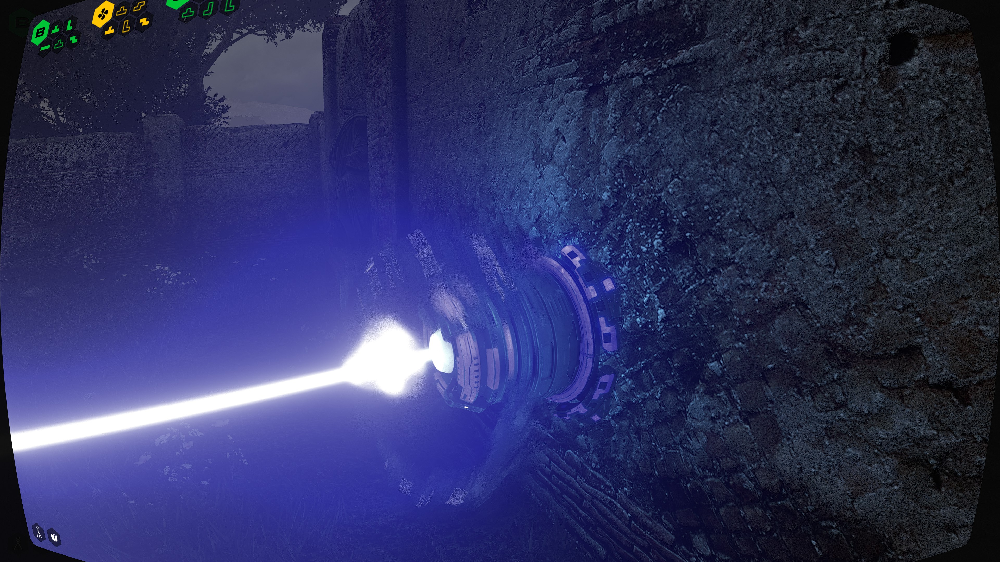

# Summary

This repository is

* a collection of couple of my simple ReShade shaders
* a library of many publicly available awesome shader repositories (via submodules)
  * (some may point to my personal fork of those repositories with various fixes + extra features for my needs)
* vanilla builds of Reshade (unmodified)
* Presets for random games I've played like this (which I cared to preserve)

# Own Shaders

## FastMotionBlur.fx (Batteries NOT included)

Simple blue-noise based motion blur which can give decent results from 3-4 samples only per pixel. Even one sample is workable but that's too noisy. It uses **Jakub Maksymilian Fober's** `ColorAndDither.fxh` modified to use a renamed texture (to avoid shader clash). It can also accumulate multiple frames into one for even more cinematic look...

and for annoying your gamer friends...

for whom 60 fps barely registers as motion, and who says things like "I cannot go to the cinema, the slideshows there about the movies are too fast for me. I'll just watch the 144 fps AI frame-interpolated version. What is 'artistic intent'?"

Velocity calculation (or optical flow) is not included, other awesome people have already done an excellent job at that, I personally prefer (and configured to use by default) **Pascal Gilcher's** `Launchpad`. Older versions which doesn't approximate pixel perfect velocity buffers work better, as FastMotionBlur doesn't concern Circle of Confusion, the fuzzyness of the optical flow estimates actually improved the looks (even tho they're not accurate) (in my subjective opinion).

**Baldur's Gate 3**

**Talos Principle**

Generally it also does a good job at sprite-flames/sprite-smoke/sprite-splashes or other particle effects, especially on older games where their motion is not considered in their design.

## Smearing

Motion based distortion effect for emulating a certain style of smearing from animation (streaks distortion). Can be used in tandem with `FastMotionBlur.fx`

**Anger Foot**

## BlendPrevious[0..4].fx

Blend current color buffer with a previously saved state in the ReShade post-process pipeline. 'Nuf said.

# Presets

They're only there for my personal record, most probably doesn't work. Many more refer to shaders behind paywall. I host them public for sharing tho.

# Shader-folder-merger

To use all the reshade goodies adhoc in games, I have a script which merges the many repositories into a single `reshade-shaders` folder via symlinks (`Misc/CollectAll.ps1`), then I symlink that folder into the games. Symlinks need admin privileges on Windows because MS just likes chaos. This is done so when I edit a shader with the built-in editor I don't need to remember myself where that shader came from originally and I can push my modifications to my forks.